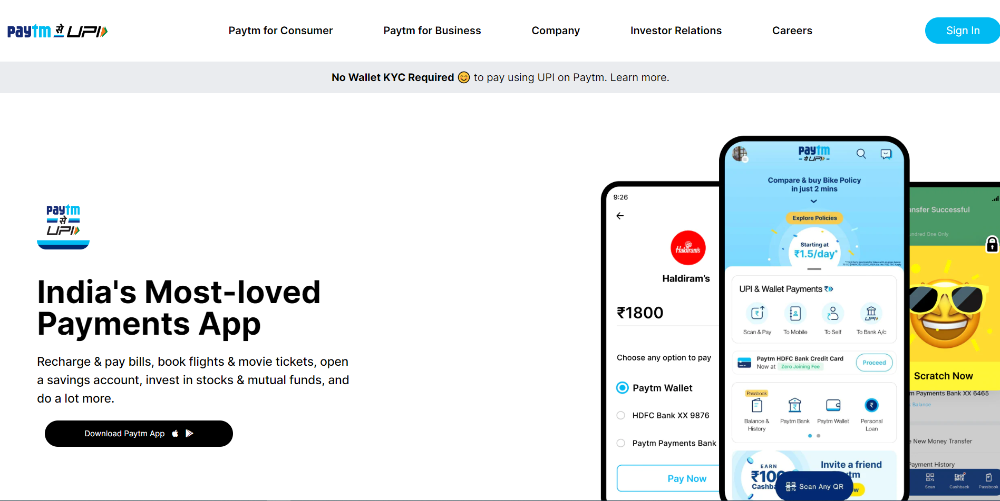

# Paytm-Clone

**I have designed a UI of Paytm home page.**

> What is Paytm? Paytm stands for Pay through mobile and it is India's largest mobile payments and commerce platform.

## Technologies Used:

> HTML  
> CSS  
> Tailwind CSS

## Features:

- Responsive
- Short and Simple
- Under 1000 lines of code

## Time Taken:

This project has taken total time of around 10 hours from scratch.

## Some Screenshots are attached here:

### **Desktop**:

## **Mobile**:

Here are some screenshots of mobile view:

